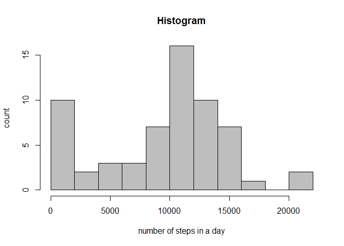
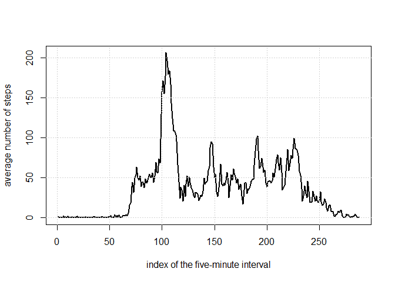

# Reproducible Research: Peer Assessment 1


We'll start by loading the packages that will be used for this assignment.


```r
library(dplyr)
library(lubridate)
library(ggplot2)
```
Next, we'll load the data for the assignment. As described in the instructions,
the data consists of the number of steps taken by an individual collected
in five-minute intervals, every day for two months.

## Loading and preprocessing the data


```r
df <- read.csv("activity.csv")
str(df)
```

```
## 'data.frame':	17568 obs. of  3 variables:
##  $ steps   : int  NA NA NA NA NA NA NA NA NA NA ...
##  $ date    : Factor w/ 61 levels "2012-10-01","2012-10-02",..: 1 1 1 1 1 1 1 1 1 1 ...
##  $ interval: int  0 5 10 15 20 25 30 35 40 45 ...
```

It may be useful to parse the date column as `Date`, so let's do that using the 
lubridate package.


```r
df$date <- ymd(df$date)
```

We also notice that five-minute interval identifiers that go from 
1 to 288 (= 24 $\times$ 12) would be more intuitive than the entries in the 
`interval` column. We'll call the new column `interval_id`.


```r
df$interval_id <- rep(1:288, length.out = nrow(df))
```

Finally, let's look at the missing values situation.


```r
colSums(is.na(df))
```

      steps        date    interval interval_id 
       2304           0           0           0 

We note that there are 2304 missing values in the steps column, which is the only
column with missing values. In particular, there are 8 days where all the `steps` 
entries are missing (2304 = 288 $\times$ 24). We'll deal with those later.

## What is mean total number of steps taken per day?

Here are the instructions for this part of the assignment:

*For this part of the assignment, you can ignore the missing values in
the dataset.*

1. *Make a histogram of the total number of steps taken each day*

2. *Calculate and report the **mean** and **median** total number of steps taken per day*


In order to answer this question, we'll use functions from the ` dplyr` package.  

We'll do a group by and then take the mean.


```r
df2 <- df %>%
group_by(date) %>%
summarize(sum_step_day = sum(steps, na.rm = T))
```
Now, we are ready to plot the histogram.

```r
hist(df2$sum_step_day, xlab = "number of steps in a day", 
     ylab = "count", breaks = 10, col = "gray", main = "Histogram")
```

<!-- -->

The mean number of steps taken per day is ``9354.23`` and the
median is ``10395``.

## What is the average daily activity pattern?

Here are the instructions for this part:

1. *Make a time series plot (i.e. `type = "l"`) of the 5-minute interval (x-axis) and the average number of steps taken, averaged across all days (y-axis)*

2. *Which 5-minute interval, on average across all the days in the dataset, contains the maximum number of steps?*

This time, we do a group by interval.


```r
df3 <- df %>%
group_by(interval_id) %>%
summarize(avg_step = mean(steps, na.rm = T))
```
Now, make the plot.


```r
with(df3, plot(interval_id, avg_step,type = "l", 
               ylab = "average number of steps", 
               xlab = "index of the five-minute interval",
               lwd = 2))
grid() # add grid lines
```

<!-- -->

The five-minute interval that has the maximum steps on average is the
``104``-th interval.


## Imputing missing values

In the following, find the questions in *italics* and the answers after each 
question.

*Note that there are a number of days/intervals where there are missing
values (coded as `NA`). The presence of missing days may introduce
bias into some calculations or summaries of the data.*

1. *Calculate and report the total number of missing values in the dataset (i.e. the total number of rows with `NA`s)*

The number of rows with missing values is ``2304``.

2. *Devise a strategy for filling in all of the missing values in the dataset. The strategy does not need to be sophisticated. For example, you could use the mean/median for that day, or the mean for that 5-minute interval, etc.*

For this part, we decided to use the mean for that five-minute interval to fill
in the missing values. 


3. *Create a new dataset that is equal to the original dataset but with the missing data filled in.*

Let's start by finding the interval indices for which the 
number of steps is not available.


```r
df_new <- df
na_idx <- which(is.na(df_new$steps)) # row ids 
na_int_idx <- df_new$interval_id[na_idx] # interval ids
```
Now, we'll fill those entries with the average number of steps from the respective
interval. Note that we had already calculated those average values above, stored 
in `df3`.


```r
df_new$steps[na_idx] <- df3$avg_step[na_int_idx]
```

4. *Make a histogram of the total number of steps taken each day and Calculate and report the **mean** and **median** total number of steps taken per day. Do these values differ from the estimates from the first part of the assignment? What is the impact of imputing missing data on the estimates of the total daily number of steps?*

We'll repeat what we did for Question 1, this time for `df_new`.


```r
df2_new <- df_new %>%
group_by(date) %>%
summarize(sum_step_day = sum(steps, na.rm = T))
```
Now, we are ready to plot the histogram.

```r
hist(df2_new$sum_step_day, xlab = "number of steps in a day", 
     ylab = "count", breaks = 10, col = "gray", main = "Histogram")
```

<!-- -->


```r
mean(df2_new$sum_step_day)
```

[1] 10766.19

```r
median(df2_new$sum_step_day)
```

[1] 10766.19

Note that the mean value has gone up. What happened here is that there were 8
days with all missing entries. For those days, the total number of steps were
recorded as zero. By filling the missing values with the interval averages, we're
essentially assigning the **mean of the non-missing days** to those entries. By replacing zero
entries with positive values, we increase the mean.

In this particular case, the median also happens to be one of these filled-in values, 
hence the median is the same with mean. 

Therefore, the effect of imputing missing values in this particular way increased the mean
and median. Because missing values were causing the number of steps to be recorded as zero, 
if we assume the person did take steps those days, imputing helped us get estimates closer to reality. 


## Are there differences in activity patterns between weekdays and weekends?

In the following, find the questions in *italics* and the answers after each 
question.


1. *Create a new factor variable in the dataset with two levels -- "weekday" and "weekend" indicating whether a given date is a weekday or weekend day.*

We'll use the dataset with the missing values filled in, i.e., `df_new` we 
created above. Note that we use the `wday()` function from the `lubridate` package
in the following.


```r
wknd <- ifelse(wday(df$date) %in% c(1,7) , "weekend","weekday")
df_new$wknd <- factor(wknd)
str(df_new)
```

```
## 'data.frame':	17568 obs. of  5 variables:
##  $ steps      : num  1.717 0.3396 0.1321 0.1509 0.0755 ...
##  $ date       : Date, format: "2012-10-01" "2012-10-01" ...
##  $ interval   : int  0 5 10 15 20 25 30 35 40 45 ...
##  $ interval_id: int  1 2 3 4 5 6 7 8 9 10 ...
##  $ wknd       : Factor w/ 2 levels "weekday","weekend": 1 1 1 1 1 1 1 1 1 1 ...
```


2. *Make a panel plot containing a time series plot (i.e. `type = "l"`) of the 5-minute interval (x-axis) and the average number of steps taken, averaged across all weekday days or weekend days (y-axis).* 

We'll do a group by first then make the plot.

```r
df_plot <- df_new %>%
        group_by(wknd, interval_id) %>%
        summarize(step = mean(steps))

qplot(data = df_plot, x = interval_id, y = step, facets = wknd ~ ., 
      geom = "line")
```

<!-- -->

We notice that during these two months, the person seems to have started the day 
late and end the day late in weekends compared to weekdays. Weekends also see
more activity throughout the waking hours.
